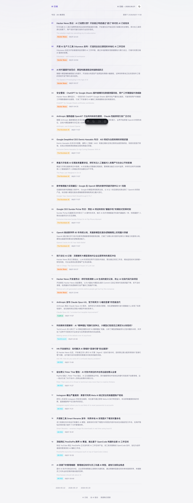
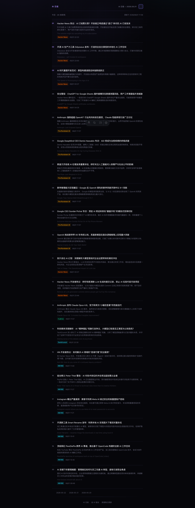

# AI 日报 (AI Daily News)

每日 AI 资讯聚合站，自动抓取 Hacker News、The Rundown AI、TLDR AI、RSS 等来源的 AI 新闻，按热度排序并保证来源多样性，通过 oMLX/DeepSeek 生成有吸引力的中文标题和摘要，构建为静态页面部署到 Cloudflare Pages。

**亮色主题：**



**暗色主题：**



## 快速开始

```bash
# 安装依赖
pnpm install

# 配置环境变量
cp .env.example .env
# 编辑 .env 填入 DEEPSEEK_API_KEY（生产环境需要，本地可用 oMLX）

# 抓取新闻 + 生成摘要
# 注意：使用本地 oMLX 时需先启动模型服务（默认 localhost:8000）
# 如果 .env 中配置了 AI_PROVIDER=deepseek，则无需本地模型
pnpm fetch-news

# 本地开发
pnpm dev

# 构建
pnpm build
```

## 文档

- [项目架构](docs/architecture.md)
- [数据抓取](docs/data-fetching.md)
- [部署指南](docs/deployment.md)

## 技术栈

| 层 | 选型 |
|---|---|
| 前端 | Astro (SSG) |
| AI 摘要 | oMLX (本地 macOS) / DeepSeek API |
| 数据源 | HN API、The Rundown AI、TLDR AI、RSS (TechCrunch/VentureBeat 等) |
| 部署 | Cloudflare Pages |
| CI/CD | GitHub Actions |

## 数据来源

| 来源 | 方式 | 热度权重 |
|---|---|---|
| Hacker News | Firebase API (top 200) | 实际 score |
| The Rundown AI | sitemap.xml | 固定 50 |
| TLDR AI | 页面 `<h3>` 抓取 | 固定 30 |
| RSS 订阅 | rss-parser (TechCrunch、HN RSS、The Verge、VentureBeat) | 固定 20 |

## 特色

- **中文优先**：所有标题和摘要均为中文，面向国内用户
- **爆款标题**：AI 生成有吸引力的标题，包含关键人名/公司名，突出核心事件
- **热度排序**：按 score 降序排列，热门新闻优先展示
- **来源多样性**：每种来源最多 6 条，保证信息来源均衡
- **暗色/亮色主题切换**：支持双主题，Header 一键切换，自动跟随系统偏好，紫色/青色主色调，网格背景，环境光渐变，卡片悬停动画
